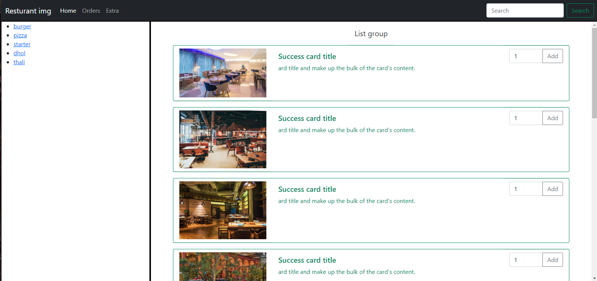
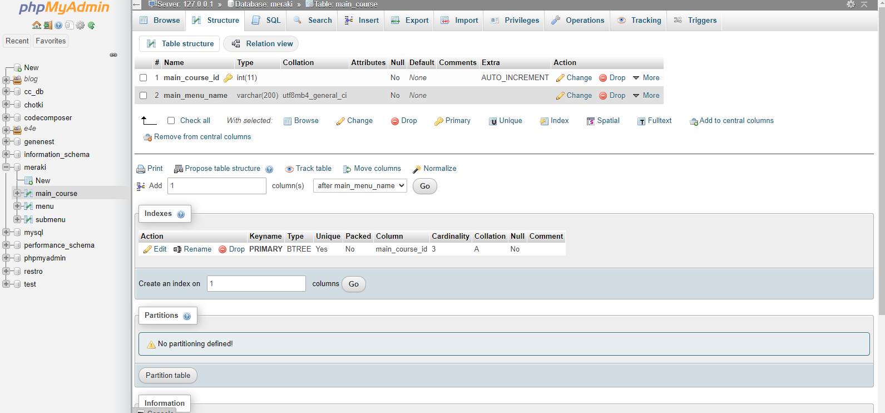
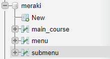

# Restruant

This is a restaurant billing service website that creates bills for customers and for the company and save data into the database for future use.
It Collects data of the customes, so that we can see their shopping or billing history.

## Current Progress

> Frontend

> Database

## How to contribute?

- Check for the already created issue
- If you have new ideas to discuss then you can make use of Discussions
- Fork the repo
- Create new Branch
- Create PR

